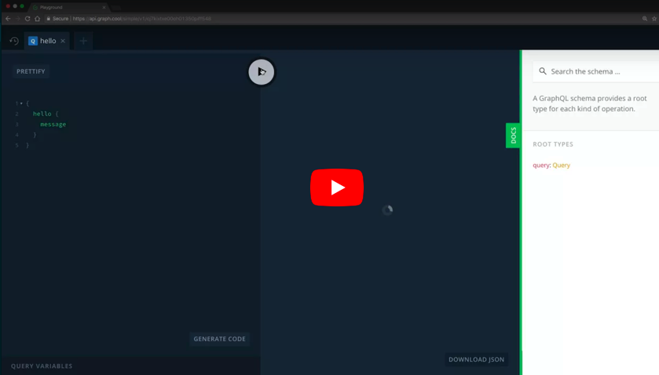

# graphcool-examples

Collection of Graphcool example projects 💡

## Getting Started

[](https://www.youtube.com/watch?v=gg_SJ8a5xpA)

```sh
npm install -g graphcool@beta
graphcool init
```

## Project Setup

The configuration of a Graphcool project is stored in the `graphcool.yml` file, containing the following components:

* **type definitions** control your DB and API structure
* **modules** structure your code in logical components
* **functions** extend your API and implement business logic
* **permissions** control authorization for your project
* **root tokens** give functions or external scripts full API access

From individual properties in `graphcool.yml`, you can reference other files to include type definitions, function code and more. You can manage different project environments in `.graphcoolrc`. A new project will be initialized with the default environment `dev`.

### Deployment

Changes to the local project configuration need to be deployed to be reflected by your Graphcool project. Running

```sh
graphcool deploy
```

will deploy the local configuration to the default environment and list all applied changes.

### Modules 🎁

Modules are a simple way to structure your configuration in logically separate units. You can add a module from a Github repository like this:

```sh
graphcool module add graphcool/modules/authentication/github
```

After a module has been downloaded, it is independent from the original, remote module. You are free to adjust the local module to fit other parts of your project configuration.

You can create your own modules or have a look at the
[Graphcool Module Collection](https://github.com/graphcool/modules) to quickly add different features to your project.


